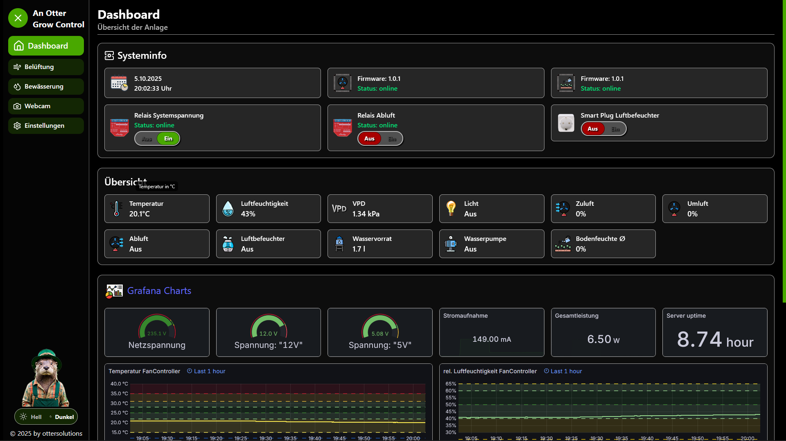
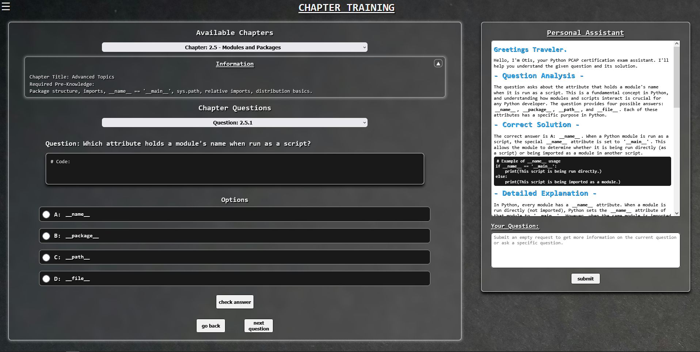
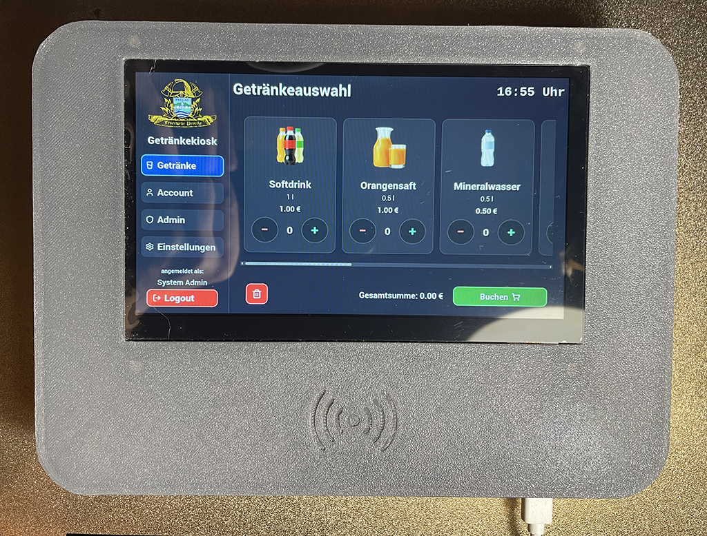
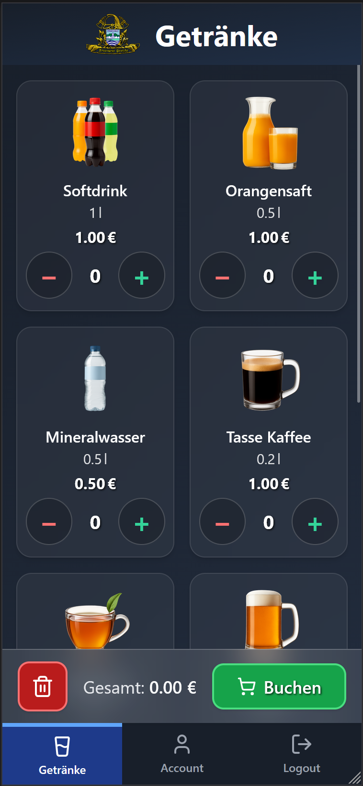

# Robert Otta - AnOtterSolution  

### 🇩🇪 Über mich  
Ich bin ein pragmatischer Entwickler mit Sinn fürs Ganze und einem interdisziplinären Hintergrund aus Elektronik, Mechanik und Software. 
Aufbauend auf meinem M.Sc. in Mechatronik und mehreren Jahren Erfahrung als Applikationsingenieur verbinde ich fundiertes Hardwareverständnis mit strukturiertem Softwaredenken und einem klaren Blick für praktikable Lösungen.

Ich entwickle gern **komplexe Systeme**, bei denen Technik auf Kreativität trifft – von automatisierten Hardwarelösungen über Embedded-Controller bis hin zu webbasierten Anwendungen und Tools.  
Alle Projekte hier sind **Eigenentwicklungen**, entstanden aus persönlicher Motivation, Neues zu lernen und Ideen in funktionierende Systeme zu verwandeln.  

Ich sehe mich selbst nicht als Spezialist in allen Teilgebieten, die in die hier gezeigten Anwendungen einfließen – etwa im Bereich **UI/UX Design** oder **OPSec**.  
Der Perfektionist in mir betrachtet daher keines der nachfolgenden Projekte als vollständig abgeschlossen.  
Dennoch sind alle hier vorgestellten Projekte lauffähig, werden praktisch eingesetzt und erfüllen in ihrem aktuellen Zustand zuverlässig ihren jeweiligen Zweck.

---

### 🧰 Technologien & Werkzeuge  
**Sprachen:** C, C++, C#, Python, JavaScript, HTML  
**Datenbanken:** SQLite, MySQL, MongoDB, InfluxDB  
**Tools & Frameworks:** Docker, PlatformIO, Flask/FastAPI, Qt, LabView, Grafana, MATLAB/Simulink, Tecap Automated Test PLatform
**CAD / Hardware:** Autodesk Eagle/Inventor, SolidWorks 

---

### 🚀 Projekte (Auswahl)

#### 🪴 [An Otter Grow Control](https://github.com/AnOtterSolution/an-otter-grow-control)
IoT-basiertes Steuerungssystem zur automatisierten Überwachung und Regelung von Umweltparametern in einem Mini-Gewächshaus.  
Kombiniert **Firmware, Hardware-Design, Frontend, Backend und Datenvisualisierung** in einer modularen Docker-Architektur.  
> *Komplett eigenständige Entwicklung – zeigt Hardware-, Software- und System-Integration.*

|    |    |
|:--:|:--:|
|  | 

#### 💻 [An Otter PCAP Trainer](https://github.com/AnOtterSolution/an-otter-pcap-trainer)
Lern- und Trainings-App für das Python PCAP Examen, mit Trainigsmodi für kapitelbasiertes Training, zufällige Fragen, Prüfungssimulationen und einem integrierten Groq Assistenten (ChatBot) zur Erklärung von Fragen und Themenkomplexen.  

> *Demonstriert Python-, Flask- und einfache Frontend-Kenntnisse sowie Datenbank- und Test-Struktur.*

|    |
|:--:|
|

#### ☕ [An Otter Kiosk](https://github.com/AnOtterSolution/an-otter-kiosk)

Ein Touch-basiertes, digitales Kassensystem für kleine Vereine und Gemeinschaften auf Basis eines **Raspberry Pi 5 B**. Ermöglicht die Nutzung über ein HMI mit RFID Authentifizierung, sowie über mobile Geräte durch einen eigenen WLAN‑Access‑Point und Einbindung in das lokale Netzwerk über LAN.

> *Verbindet Embedded- und UI-Design mit Datenbank-Logik und Hardware-Integration.*

|    |    |
|:--:|:--:|
|  |  |

---

### 🧩 Aktuell  
Ich erweitere meine Projekte laufend und experimentiere mit neuen Technologien im Bereich **IoT, Automatisierung und Softwareentwicklung**.  

📍 Magdeburg, Deutschland  
📫 ottersolutions@gmx.de  

---

### 🇬🇧 About Me  
I am a pragmatic developer with a holistic mindset and an interdisciplinary background in electronics, mechanics, and software. 
Building on my M.Sc. in Mechatronics and several years of experience as an application engineer, I combine solid hardware expertise with structured software thinking and a clear focus on practical, reliable solutions.

I enjoy creating **complex systems** where technology meets creativity – from automated hardware setups and embedded controllers to web-based tools and applications.  
All projects shown here are **independent developments**, created from personal curiosity, the desire to learn, and the goal of turning ideas into functional, well-integrated systems.  

I don’t consider myself a specialist in all the disciplines that flow into the applications shown here – for example, in **UI/UX design** or **OPSec**.  
The perfectionist in me therefore doesn’t regard any of the following projects as truly finished.  
Nevertheless, all presented projects are fully functional, actively used, and reliably serve their intended purpose in their current state.

---

### 🧰 Technologies & Tools  
**Languages:** C, C++, C#, Python, JavaScript, HTML  
**Databases:** SQLite, MySQL, MongoDB, InfluxDB  
**Tools & Frameworks:** Docker, PlatformIO, Flask/FastAPI, Qt, LabView, Grafana, MATLAB/Simulink, Tecap Automated Test Platform  
**CAD / Hardware:** Autodesk Eagle/Inventor, SolidWorks  

---

### 🚀 Projects (Selection)

#### 🪴 [An Otter Grow Control](https://github.com/AnOtterSolution/an-otter-grow-control)
IoT-based control system for the automated monitoring and regulation of environmental parameters in a mini-greenhouse.  
Combines **firmware, hardware design, frontend, backend, and data visualization** within a modular Docker architecture.  
> *Completely self-developed – demonstrates full integration of hardware, software, and system design.*

|    |    |
|:--:|:--:|
|  |  |

#### 💻 [An Otter PCAP Trainer](https://github.com/AnOtterSolution/an-otter-pcap-trainer)
Learning and training app for the Python PCAP exam.  
Includes chapter-based training, random question mode, exam simulations, and an integrated **Groq Assistant (chatbot)** to explain questions and concepts.  
> *Demonstrates Python, Flask, and basic frontend skills, as well as database and testing structure.*

|    |
|:--:|
|  |

#### ☕ [An Otter Kiosk](https://github.com/AnOtterSolution/an-otter-kiosk) 
Touch-based digital point-of-sale system for small clubs or communities, built on a **Raspberry Pi 5 B**.  
Supports use via touchscreen HMI with **RFID authentication** and via mobile devices through a local WLAN access point and LAN integration.  
> *Combines embedded and UI design with database logic and hardware integration.*

|    |    |
|:--:|:--:|
|  |  |

---

### 🧩 Currently  
I continuously expand my projects and explore new technologies in the fields of **IoT, automation, and software development**.  

📍 Magdeburg, Germany  
📫 ottersolutions@gmx.de  

---

*"Simple ideas. Smart execution. An Otter Solution."* 🦦
